Sovellus on yksinkertainen nettisivu omien liikuntatottumusten seurantaan. Se sisältää mahdollisuudet BMI:n laskemiselle, sekä omien liikuntasuoritusten kirjaamiselle. Sovellus ei vaadi sisäänkirjautumista sen käyttöä varten, mutta mikäli omia liikuntatietoja haluaa tallentaa, on se välttämätöntä. Ohessa kuva tietokantarakenteesta, jota sovellus käyttää.

## Tietokantarakenne
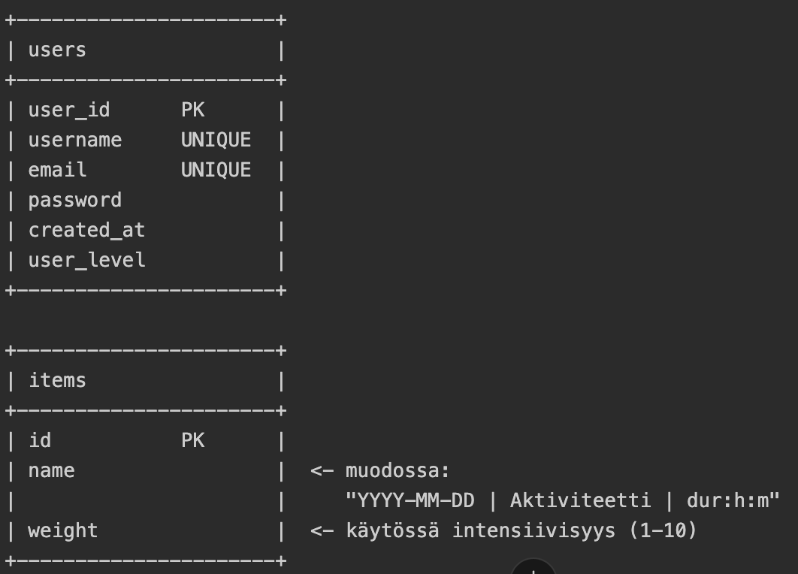

Koodin kehittämisessä on hyödynnetty opettajien esimerkkikoodeja, sekä tekoälytyökaluja, kuten ChatGPT:tä ja Codexia. Tekoälyä on käytetty laajalti tukena koodin ideoinnissa, rakenteen hahmottamisessa ja ongelmien ratkaisemisessa. Lopullinen toteutus ei kuitenkaan ole suoraan tekoälyn tuottama, vaan sitä on muokattu ja sovellettu projektin tarpeisiin. Sivuston kehittäjä ymmärtää koodin toiminnan kokonaisuudessaan.

## Tehdyt tehtävät, Terveyssovelluksen kehitys, Testaus

### Tehtävä 1

Asennettu seuraavat työkalut:
- Robot Framework
- Browser Library
- Requests library
- CryptoLibrary
- Robotidy

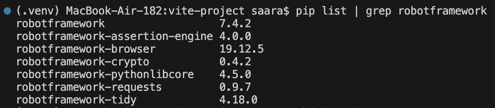
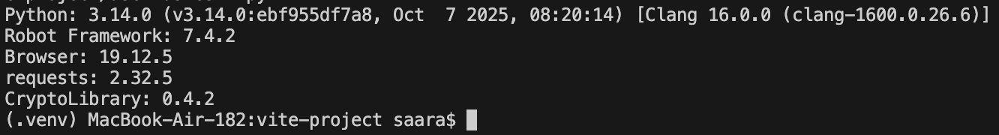

Tekoäly ChatGPT:ltä kysytty apua asennuksiin

### Tehtävä 2

- Tiedostot keywords.robot ja browser_demo.robot luotu
- Yllä mainittuihin kopioitu opettajan antamat koodirivit
- Koodi muokattu omaan sivustoon sopivaksi
- Debuggauksessa käytetty apuna tekoälytyökalu Chat-GPT:tä
- Tietokanta ei käytössä, joten sisäänkirjautuminen ei onnistu puuttuvien käyttäjätietojen vuoksi, testi onnistuu kuitenkin
[Report](tests/outputs/report.html)
[Log](tests/outputs/log.html)

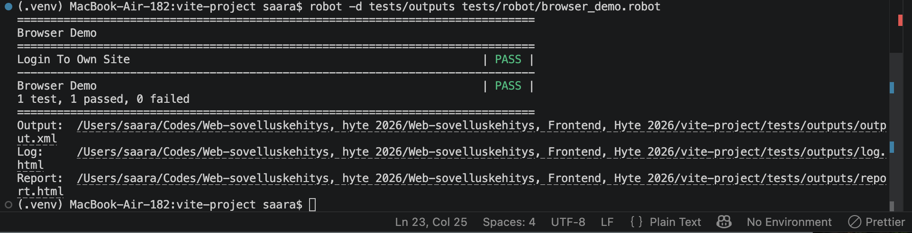
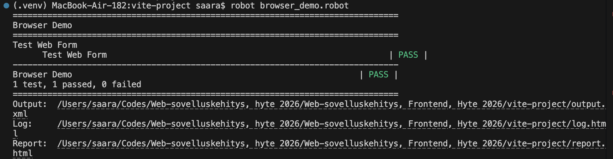

### Tehtävä 3

- .env tiedosto luotu
- .env lisätty .gitignoreen
- load_env.py tiedosto lisätty
- python-dotenv-kirjasto ladattu verkkoympäristöön
- web-form.robot luotu: täällä käytetään tuota Python-kirjastoa
- CryptoLibrary asennettu
- Salausavaimet generoitu

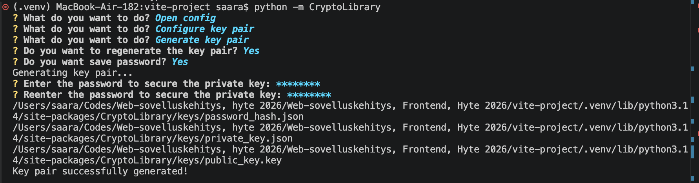

- Salasana ja käyttäjänimi salattu käyttäen CryptoClientia, jotta ne eivät ole koodissa näkyvissä

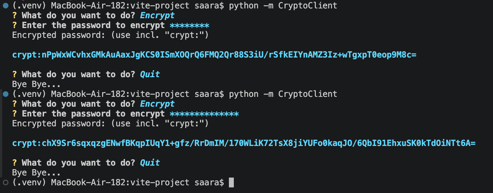

- Lisätty testejä Web form -esimerkkisivun muiden kenttien toiminnasta: select dropdown, datalist, file input, checkbox ja radio button
- Testit ajettu onnistuneesti
[Report](tests/outputs/report.html)
[Log](tests/outputs/log.html)

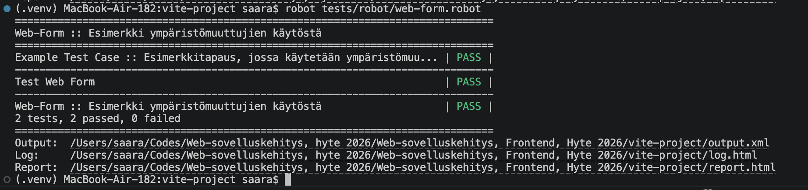

Tekoäly ChatGPT:tä käytetty työkaluna tehtävänannon ymmärtämisessä, oikeiden komentojen löytämisessä sekä debuggaamisessa

### Tehtävä 4

- oma-sovellus.robot tiedosto luotu
[Oma sovellus testi](tests/robot/oma-sovellus.robot)
- Robot testi täyttää kentät onnistuneesti, mutta merkintä ei tallennu ilman sisäänkirjautumista
- Sisäänkirjautumistesti lisätty
- Käyttäjätunnus ja salasana tulevat piilotetusta keywords.robot tiedostosta
- Diary entry onnistui
[Report](tests/outputs/report.html)
[Log](tests/outputs/log.html)
- ChatGPT:tä käytetty työkaluna ongelmakohtien ratkaisussa

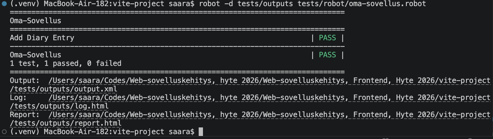

### Tehtävä 5

- .env tiedostoon lisätty USERNAME, PASSWORD ja FRONTEND_URL
    - Front- ja backend-URL:t eroteltiin selkeyden vuoksi
- Tiedosto oma-kirjautumistesti-env.robot luotu
[Kirjautumistesti .env](tests/robot/oma-kirjautumistesti-env.robot)
- USERNAME, PASSWORD ja FRONTEND_URL lisätty load_env.py tiedostoon
[Load_env](tests/load_env.py)
- Kirjautuminen onnistui
[Report](tests/outputs/report.html)
[Log](tests/outputs/log.html)
- ChatGPT:tä käytetty työkaluna ongelmakohtien ratkaisussa

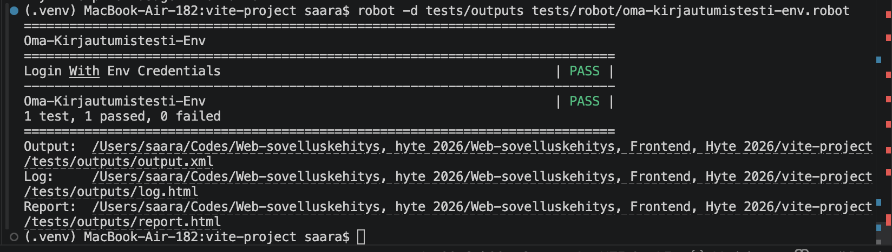

### Tehtävä 6

- oma-kirjautumistesti-crypto.robot tiedosto luotu
[Cryptattu kirjautumistesti](tests/robot/oma-kirjautumistesti-crypto.robot)
- Kirjautumistesti tehty käyttäen CryptoLibrarya
- Salasana ja käyttäjätunnus kryptatty CryptoClientilla
- Testi ajettu onnistuneesti
[Report](tests/outputs/report.html)
[Log](tests/outputs/log.html)
- ChatGPT:tä käytetty työkaluna ongelmakohtien ratkaisussa

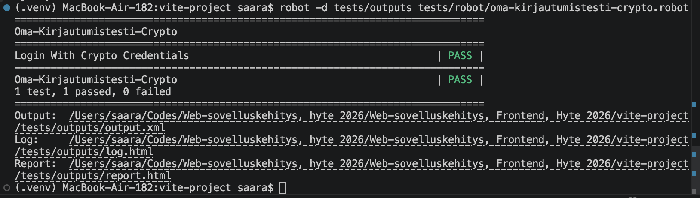

### Tehtävä 7

- Testien loki- ja raporttitiedostot on ohjattu erilliseen `tests/outputs/`-kansioon ajamalla testit komennolla:
`robot -d tests/outputs tests/robot/tiedostonimi.robot`

- Tämän seurauksena `output.xml`, `log.html` ja `report.html` tallentuvat `tests/outputs/`-kansioon.

### Tehtävä 8

- Tutustuttu https://sakluk.github.io/projekti-terveyssovelluksen-kehitys/ohjeet_testaus/04_raportit_ja_lokitiedostot.html 
- ChatGPT:tä käytetty apuna ymmärtämisessä
- Luotu tests/outputs/README.md
[outputs readme](tests/outputs/README.md)
- Luotu tests/robot/README.md
[robot readme](tests/robot/README.md)
- Luotu tests/README.md
[testit readme](tests/README.md)

- Outputs readme.md lisätty linkit outputs tiedostoihin
- Robot readme.md lisätty linkit robot testeihin
- Testit kansion juuren readme.md lisätty linkit outputs kansioon sekä robot kansioon 

#### Linkit testeihin ja raportteihin

- [Tests-kansio](tests/)
- [Robot-testit](tests/robot/)
- [Outputs](tests/outputs/)
- [Report](tests/outputs/report.html)
- [Log](tests/outputs/log.html)

#### github.io sivusto
- https://saarakoskinen.github.io/hyte_project_frontend/ 